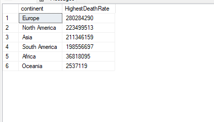
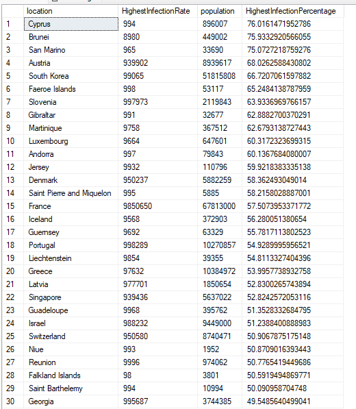
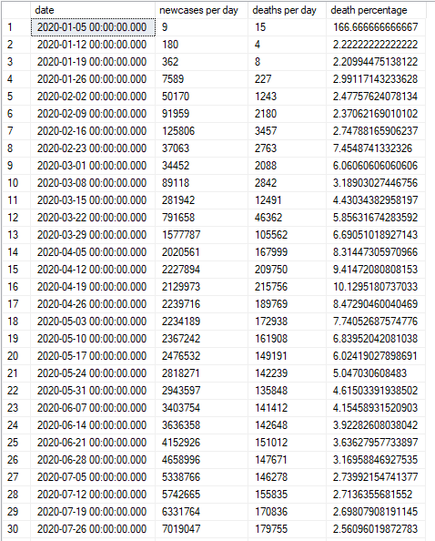
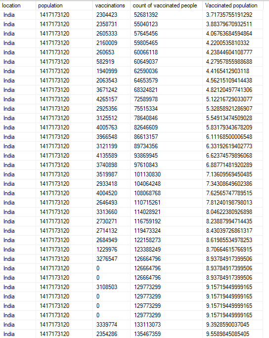

# COVID-19 Global-Analysis

## Table of Contents
- [Project Overview](#Project-Overview)
- [Data Sources](#Data-Sources)
- [Tools](#Tools)
- [EDA Steps](#EDA-steps)
- [Finding](findings)

## Project Overview
This project conducted an in-depth exploration of COVID-19 data to analyze trends and patterns in India and worldwide
We perform the in-depth Data Exploration, EDA and analysis. We have use SQL tools like Joins, CTE's, Temp Tables, Aggregate Functions, Converting Data Types, Case statements.


## Data Sources
The dataset we use in this Analysis is available on [Our Wolrd In Data](https://ourworldindata.org/covid-deaths). The data in the database contan detailed information  about Covid-19 cases globally from  January, 2020 to December, 2023. Our database are divided into two tables Covid Deaths and Covid Vaccinations.


## Tools
* SQL: Data Retrieval, Data Exploration
* Excel: Data Imprting, Data Cleaning


## EDA Steps
Exploratory Data Analysis (EDA) involves a series of steps to understand and analyze a dataset. Here are the typical steps involved in EDA:
1. Collect the data and import the data in excel, Understand the data in the columns, Data type, Meaning of data and for what we can use these columns.
2. Now start cleaning the data by deleting the unwanted columns, if possible handle missing vales and ensure that data is in right format
3. Start forming the relation between the variables and gather useful insights
4. With the help of the SQL we perform and our analysis and drive the different results from the dataset. We will use diiferent tools and function present in the SQL make conclude our results.


## Findings
Some The result that we find Through this analysis are  
1. Total number of deaths in each continent
```sql
SELECT continent,SUM(CAST(total_deaths as int)) HighestDeathRate
FROM portfolio_project..CovidDeaths
WHERE continent IS not NULL 
GROUP BY continent
ORDER BY HighestDeathRate DESC
```


2. Percentage of the total population in each country infected with the virus
```sql
SELECT location,MAX(total_cases) HighestInfectionRate, population,
MAX((CAST(total_cases AS float)/CAST(population AS float))*100) AS HighestInfectionPercentage
FROM portfolio_project..CovidDeaths
WHERE continent IS NOT NULL
GROUP BY location, population
ORDER BY HighestInfectionPercentage DESC
```



3. Number of people get infected per day from the virus vs Deaths per day
```sql
SELECT date, SUM(new_cases) as [newcases per day],SUM(CAST(new_deaths as int)) [deaths per day],
SUM(CAST(new_deaths as int))/SUM(new_cases)* 100 [death percentage]
FROM portfolio_project..CovidDeaths 
WHERE new_deaths is not NULL
GROUP BY date
ORDER BY 1,2
```



4. Nmber of people getting vaccination everyday
```sql
with PopvsVac (date , continent, location , population, vaccinations, [count of vaccinated people])
as(
select	deaths.date, 
		deaths.continent, 
		deaths.location,
		deaths.population, 
		isnull(vac.new_vaccinations,0) as [Vaccinations per day], 
		sum(cast(isnull(vac.new_vaccinations,0) as bigint))
				over (partition by deaths.location order by deaths.date,deaths.location) as [count of vaccinated people]
from portfolio_project..CovidDeaths deaths
join portfolio_project..CovidVaccination vac
	on deaths.location = vac.location
	and deaths.date = vac.date
where deaths.continent is not null
)
select location, population, vaccinations,[count of vaccinated people], ([count of vaccinated people]/population)*100 as [Vaccinated population]
from PopvsVac;
```



